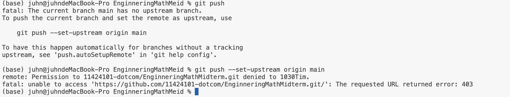

# EnginneringMathMidterm

`11424101陳閔駿`

## Process
1. Read the  topic
2. Read all class pages
3. think the question Laplace transform？
4. I can't not because is difficult. than i have ask GPT

## Question GPT
1. fast my token is `help me over this homework use the Laplace transform`
2. GPT output `Second-Order Differential Equations `
3. i thank is't `Laplace transform`

## version
YYYY/MM/DD 

- 2026/4/18 fast use cmd git push to github
- 2026/4/19 modify latex to github

## Error and Debug

- In Vscode can use LaTex but to Github can't
`ex: you can as < br > but in Vscode`

